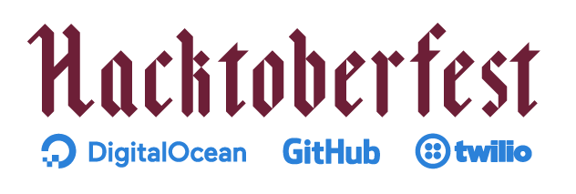

<p align="center">
  
  
</p>

## :books: Instructions
1. Goto [Hacktoberfest](https://hacktoberfest.digitalocean.com/) site and [Sign Up](https://hacktoberfest.digitalocean.com/sign_up/register) with your Github Account
2. Goto [Contribution](/contribution) Folder
3. Create a new folder in your **Github username**
4. Goto Bottom of the page, On Commit changes check the checkbox <b>Create a new branch for this commit and start a pull request</b> and Click on <b>Propose File Change</b> Button
5. On next page click on <b>Create Pull Request</b>
6. **Your Pull Requested will be accepted within an hour**<br>
7. After getting your PR accepted **Goto your folder and add the source code of a program coded by yourself**
8. Goto Bottom of the page, On Commit changes check the checkbox <b>Create a new branch for this commit and start a pull request</b> and Click on <b>Propose File Change</b> Button
9. On next page click on <b>Create Pull Request</b>
10. Repeat steps 7-9 by adding source code of different programs and **Check your Progress in Hacktobefest site**
11. ready to rock
## :pencil: Important Note 
- [Students](/students) folder is reserved for students of [Amal Jyothi College of Engineering](https://ajce.in)
- Others contribute to [Contribution](/contribution) folder

## :rotating_light: Warning
- Request only genuine PR's as given in the Instruction
- Genuine PR's will be merged to the repo and you will be added as a [Contributor](https://iodevelopers.github.io/hacktoberfest/contributors.html) in the site
- Spam PR's requested will not be counted by the Hacktoberfest and will not be merged to repo
- Follow the Instructions strictly

## :computer: Getting Started

- Fork this repo (button on top)
- Clone on your local machine

```terminal
git clone https://github.com/IODevelopers/hacktoberfest.git
cd hacktoberfest/contribution
```
- Create a new branch

```markdown
git checkout -b my-new-branch
```
- Add your contribution
```
mkdir your-github-username
cd your-github-username
//Add the source code of your program here
```
- Commit and push

```markdown
git add .
git commit -m "your-commit-msg"
git push origin my-new-branch
```

- Create a new pull request from your forked repository

## :zap: FAQs
- What is Hacktoberfest?
  - Hacktoberfest is a month-long celebration of open source software run by DigitalOcean in partnership with GitHub and Twilio.
- Who can contribute?
  - Anyone with a github account and signed up for [Hacktoberfest](https://hacktoberfest.digitalocean.com/)
- Who are you and why are you doing this?
  - We are a team of students [IODevelopers](https://github.com/IODevelopers). We are doing this because we love open
  source and Hacktoberfest. We want to make it easier for people to get started with Hacktoberfest and Open source.
- How do I track my progress?
  - Log in with your GitHub account at [Hacktoberfest](https://hacktoberfest.digitalocean.com/) to check your progress and stats.
- I completed 5 PRs. When will I receive my t-shirt?
  - We will start sending out emails with more details on redeeming t-shirts throughout the month. Stay tuned!
- How do I get stickers?
  - Stickers are included with your t-shirt, once you complete 5 PRs.
- What happens if I complete fewer than 5 PRs by the end of the month?
  - Unfortunately you will have to submit at least 5 PRs in order to get a T-shirt.
  
## :globe_with_meridians: [Organisation](https://www.iodev.co.in/)
  <p align="center">
    
  </p>


